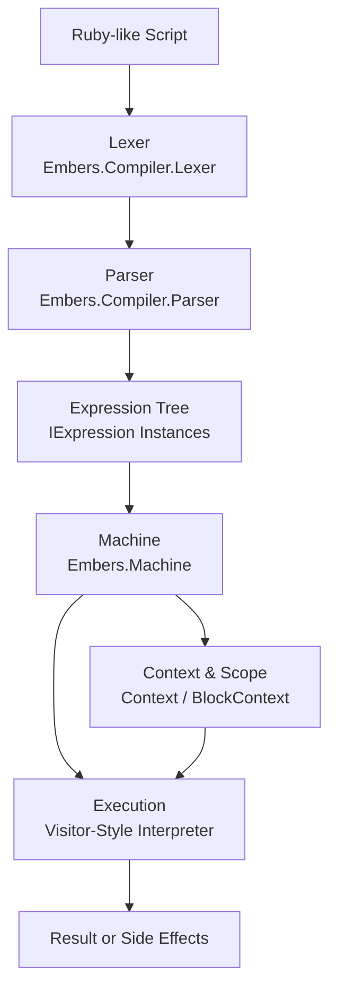
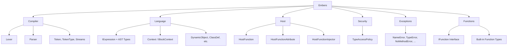

# Embers

**Embers** (Embedded Ruby Script) is a compact Ruby interpreter implemented in C# targeting .NET 9. Designed for embedding, scripting, and lightweight runtime execution, Embers brings the expressive power of Ruby to .NET-based systems.

Embers is an experimental runtime, taking inspiration from and building upon the following abandoned projects:
- [Embers by Joy-less](https://github.com/Joy-less/Embers)
- [RubySharp by AjLopez](https://github.com/ajlopez/RubySharp)

While a large portion of commonly used functions from Ruby's StdLib are present in the solution, full type binding and implementation is far from complete. Embers' architecture adheres to a strict pattern making it easy to extend, and these features will evolve and mature over time.

## Overview

Embers is built around a clean, minimal core with the goal of executing Ruby-style scripts in constrained or embedded environments. The interpreter features:

- A recursive descent parser for Ruby-like syntax
- Lexical analysis via a custom `Lexer`
- A virtual execution engine (`Machine`)
- Context-sensitive execution (`Context`, `BlockContext`)
- Robust exception model mirroring Ruby's error semantics
- Embeddability and interoperability within .NET 9 projects

---

## Design

### Execution Flow



### Logical Topography



## Projects

- `Embers`: Core interpreter (main focus)
- `Embers.Console`: Example CLI host for executing `.rb` scripts or launching an interactive REPL
- `Embers.Tests`: Unit tests covering interpreter functionality

## Design Goals

- **Portability**: Target .NET 9 with minimal external dependencies
- **Embedding First**: Built to be embedded in other applications, not just run standalone
- **Ruby-Inspired**: Implements a Ruby-like language subset with idiomatic constructs
- **Simplicity**: Clear structure with low cognitive overhead for contributors
- **Performance**: Optimized for fast startup and execution in memory-limited contexts

## Key Components

- **Lexer** (`Compiler/Lexer.cs`): Tokenizes input strings into operators, literals, variables, etc.
- **Parser** (`Compiler/Parser.cs`): Converts tokens into expression trees (`IExpression`)
- **Machine** (`Machine.cs`): Executes expression trees using a visitor-style interpreter
- **Context & BlockContext**: Manages variable scopes, closures, and execution frames
- **Registration** (`Registration.cs`): Handles registration of built-in methods and object types
- **Exceptions**: Rich error handling mimicking Ruby (e.g., `NameError`, `NoMethodError`, `SyntaxError`)

## Usage

### Embedding the Interpreter

You can embed Embers in any .NET 9 project:

```csharp
var machine = new Machine();
machine.Execute("puts 'Hello from embedded Ruby!'");
```

### CLI Usage (Example)

From `Embers.Console`:

```bash
dotnet run --project Embers.Console "script.rb"
```

Or launch the REPL:

```bash
dotnet run --project Embers.Console
```

## Script Syntax

Embers supports a substantial Ruby-like syntax:

```ruby
def square(x)
  x * x
end

puts square(10)  # => 100
```

Supports:

- Method definitions
- Variable assignments
- Control structures (`if`, `unless`, `while`, etc.)
- Class and instance variables (`@foo`, `@@bar`)
- Exceptions (`raise`, `begin/rescue/ensure/end`)

## Build & Test

### Build

```bash
dotnet build
```

### Run Tests

```bash
dotnet test Embers.Tests
```

---

## Security Configuration

Ruby-C# interop is powerful, but allowing any foreign code execution complete and unfettered access to .NET at runtime, can be equally dangerous and allows for potential malicious code injection. To combat this, Embers includes a host-level **type access policy** system to restrict which .NET types and namespaces can be accessed or exposed to the interpreter. This system is defined in `Embers.Security.TypeAccessPolicy` and enforces security through two modes:

### Security Modes

```csharp
public enum SecurityMode
{
    Unrestricted,    // All types are accessible
    WhitelistOnly    // Only whitelisted types and namespaces are allowed
}
```

- **Unrestricted**: Default mode. All types are permitted.
- **WhitelistOnly**: Only explicitly allowed types or namespaces can be accessed.

### Under the Hood

Allowed types and namespaces are configured in the policy:

```csharp
TypeAccessPolicy.SetPolicy(new[]
{
    "MyApp.API.SafeClass",
    "MyApp.Scripting.*"
}, SecurityMode.WhitelistOnly);
```

This example:
- Allows the specific type `MyApp.API.SafeClass`
- Allows all types under the `MyApp.Scripting` namespace

### Fine-Grained Controls

Policy can be manipulated at runtime by your host application:

```csharp
TypeAccessPolicy.AddType("MyApp.Tools.ScriptableAction");
TypeAccessPolicy.AddNamespace("MyApp.Sandbox");
```

To reset all policies:

```csharp
TypeAccessPolicy.Clear();
```

### Configuring the Policy

`TypeAccessPolicy` is internal only. The policy is governed by the machine (runtime) instance via the public API:

```csharp
        /// <summary>
        /// Sets the type access policy.
        /// Allowed entries are a list of full type names that are allowed to be accessed.
        /// Provide allowed entries as a list of strings where final character '.' implies a namespace.
        /// </summary>
        /// <param name="allowedEntries">The allowed entries.</param>
        public void SetTypeAccessPolicy(IEnumerable<string> allowedEntries, SecurityMode mode = SecurityMode.WhitelistOnly)
        {
            TypeAccessPolicy.SetPolicy(allowedEntries, mode);
        }

        /// <summary>
        /// Allows the type.
        /// </summary>
        /// <param name="fullTypeName">Full name of the type.</param>
        public void AllowType(string fullTypeName)
        {
            Security.TypeAccessPolicy.AddType(fullTypeName);
        }

        /// <summary>
        /// Allows the namespace.
        /// </summary>
        /// <param name="prefix">The prefix.</param>
        public void AllowNamespace(string prefix)
        {
            Security.TypeAccessPolicy.AddNamespace(prefix);
        }

        /// <summary>
        /// Clears the security policy.
        /// </summary>
        public void ClearSecurityPolicy()
        {
            Security.TypeAccessPolicy.Clear();
        }
```

### Runtime Enforcement

Any type lookups during execution check against this policy:

```csharp
if (!TypeAccessPolicy.IsAllowed(fullTypeName))
    throw new TypeAccessError(...);
```

This ensures unregistered types are never exposed to interpreted code under `WhitelistOnly` mode.

---

## Building a Custom DSL

Embers enables you to define host-side .NET methods as callable functions within Ruby scripts. This is the foundation for building domain-specific languages (DSLs) tailored to your application's runtime and obscuring your functional code.

### Define a Host Function

To define a Ruby-callable host function:

1. Inherit from `HostFunction` (defined in `Embers.Host.HostFunction`)
2. Decorate the class with `[HostFunction(...)]` and provide one or more Ruby-visible names
3. Implement the `Apply` method

#### Example

```csharp
using Embers.Host;
using Embers.Language;

[HostFunction("hello")]
internal class HelloFunction : HostFunction
{
    public override object Apply(DynamicObject self, Context context, IList<object> values)
    {
        Console.WriteLine("Hello from Embers!");
        return null;
    }
}
```

### Register Functions with the Machine

Use `HostFunctionInjector` to automatically discover and register all `[HostFunction]` classes:

```csharp
Machine machine = new();
machine.InjectFromCallingAssembly();
machine.Execute("hello"); // prints "Hello from Embers!"
```

You can also inject from a specific assembly or all referenced ones if you are follwing a plugin architecture or have separated your DSL across projects:

```csharp
machine.InjectFromAssembly(typeof(MyDSLClass).Assembly);
machine.InjectFromReferencedAssemblies();
```

### Multiple Names and Composition

You can expose a function under multiple Ruby aliases:

```csharp
[HostFunction("guid", "generate_guid")]
internal class GuidFunction : HostFunction
{
    public override object Apply(DynamicObject self, Context context, IList<object> values)
    {
        return Guid.NewGuid().ToString();
    }
}
```

Then from Ruby:

```ruby
puts guid
puts generate_guid
```

## Practical Use Cases

Embers is designed for embedding into diverse .NET applications. Here are a few practical scenarios where Embers is especially useful:

### Game Scripting in Godot (via .NET/GDScript Interop)

**Use Case**: Allow game designers to write behaviors in Ruby instead of GDScript or C#.

#### Example Integration

1. **Setup in Godot**: Use the .NET build of Godot (Godot C#).
2. **Add Embers to Your Project**:
   - Reference `Embers.dll` in your Godot C# project.
3. **Run Ruby Code in a Node**:

```csharp
using Embers;

public partial class RubyScriptRunner : Node
{
    private Machine embers;

    public override void _Ready()
    {
        embers = new Machine();
        embers.Execute("puts 'Hello from Godot via Embers!'");
    }
}
```

4. **Dynamic Behavior**: Load or hot-reload `.rb` scripts at runtime to define game logic, cutscenes, AI behavior, or level scripting.

---

### Unity Runtime Scripting

**Use Case**: Let players, modders, or developers define behaviors at runtime using embedded Ruby scripts.

#### Example Integration Steps

1. **Import Embers into Unity**:
   - Compile Embers to a `.dll` using `.NET Standard 2.1` or `.NET 7+` compatible target (based on Unity version).
   - Drop `Embers.dll` into your Unity `Assets/Plugins` folder.

2. **Execute Ruby in C# MonoBehaviour**:

```csharp
using UnityEngine;
using Embers;

public class RubyScripting : MonoBehaviour
{
    private Machine embers;

    void Start()
    {
        embers = new Machine();
        embers.Execute("puts 'Hello from Unity via Ruby!'");
    }
}
```

3. **Dynamic Gameplay Scripting**:
   - Load user-defined `.rb` files from `StreamingAssets`
   - Modify NPC behaviors, dialogues, quests at runtime

4. **Editor Tooling**:
   - Allow developers to write editor extensions or game logic using Ruby

---

### Embeddable Scripting in Desktop Apps

Let users customize workflows, write macros, or automate tasks using embedded Ruby.

```csharp
machine.Execute(@"
def greet(name)
  puts ""Hello, #{name}!""
end

greet('Alice')
");
```

---

### Scripting in Sandboxed Plugins

Expose a controlled Ruby-like API for plugin authors without risking full .NET exposure.

- Only register safe types
- Use isolated `Context` instances per plugin

## Contributing

All public methods must have test coverage. PRs must include unit tests for new functionality.

## License

MIT License
